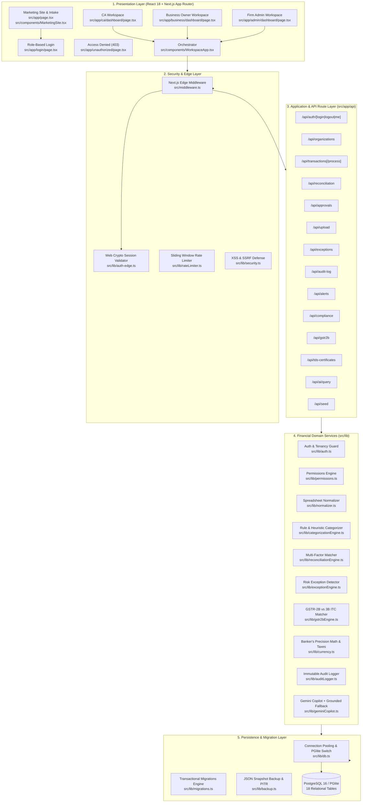

# AI Finance Copilot — Architecture Blueprint

> **System Classification**: B2B Financial Compliance & Multi-Tenant Accounting SaaS  
> **Repository Root**: `/Users/niharmehta/Desktop/AI fin ance copilot`  
> **Source Verification Date**: September 2026  
> **Runtime Environment**: Node.js 20.x, Next.js 14 App Router, PostgreSQL 16 / Embedded PGlite

---

## 1. Architectural System Overview

The AI Finance & Compliance Copilot is an enterprise financial intelligence and statutory compliance platform architected for Indian business taxation (GST, TDS, P&L, Balance Sheet, Bank Reconciliation). It is built as a multi-tenant Next.js App Router application with dual-mode database capability (embedded PGlite for offline development/testing, and managed PostgreSQL 16 for production).

---

## 2. Layer-by-Layer Verification & Specification

### Layer 1: Presentation Layer
* **Components**:
  * [src/app/page.tsx](file:///Users/niharmehta/Desktop/AI%20fin%20ance%20copilot/src/app/page.tsx): Public landing page with design-partner pilot intake form.
  * [src/app/login/page.tsx](file:///Users/niharmehta/Desktop/AI%20fin%20ance%20copilot/src/app/login/page.tsx): Authentication portal with role switcher (`CA`, `BUSINESS_OWNER`, `FIRM_ADMIN`).
  * [src/app/ca/dashboard/page.tsx](file:///Users/niharmehta/Desktop/AI%20fin%20ance%20copilot/src/app/ca/dashboard/page.tsx), [src/app/business/dashboard/page.tsx](file:///Users/niharmehta/Desktop/AI%20fin%20ance%20copilot/src/app/business/dashboard/page.tsx), [src/app/admin/dashboard/page.tsx](file:///Users/niharmehta/Desktop/AI%20fin%20ance%20copilot/src/app/admin/dashboard/page.tsx): Role workspace entry points mounting `WorkspaceApp`.
  * [src/components/WorkspaceApp.tsx](file:///Users/niharmehta/Desktop/AI%20fin%20ance%20copilot/src/components/WorkspaceApp.tsx): Single-page workspace coordinator holding state for financial ledgers, audit logs, and compliance filings.
  * [src/components/DashboardView.tsx](file:///Users/niharmehta/Desktop/AI%20fin%20ance%20copilot/src/components/DashboardView.tsx): Executive finance summary (Cash in Bank, AR, AP, Net Burn, Runway, P&L, Balance Sheet).
  * [src/components/ReviewQueueView.tsx](file:///Users/niharmehta/Desktop/AI%20fin%20ance%20copilot/src/components/ReviewQueueView.tsx): Unapproved transaction workflow and batch approvals.
  * [src/components/ReconciliationView.tsx](file:///Users/niharmehta/Desktop/AI%20fin%20ance%20copilot/src/components/ReconciliationView.tsx): Bank-to-book match matrix.
  * [src/components/ExceptionsView.tsx](file:///Users/niharmehta/Desktop/AI%20fin%20ance%20copilot/src/components/ExceptionsView.tsx): Statutory risk exceptions.
  * [src/components/UploadView.tsx](file:///Users/niharmehta/Desktop/AI%20fin%20ance%20copilot/src/components/UploadView.tsx): Ingestion drag-and-drop.
  * [src/components/GSTR2BView.tsx](file:///Users/niharmehta/Desktop/AI%20fin%20ance%20copilot/src/components/GSTR2BView.tsx): ITC claim discrepancy dashboard.
  * [src/components/TDSCertificatesView.tsx](file:///Users/niharmehta/Desktop/AI%20fin%20ance%20copilot/src/components/TDSCertificatesView.tsx): Form 16A generation and CA sign-off.
  * [src/components/ComplianceView.tsx](file:///Users/niharmehta/Desktop/AI%20fin%20ance%20copilot/src/components/ComplianceView.tsx): Statutory calendar.
  * [src/components/CopilotChatView.tsx](file:///Users/niharmehta/Desktop/AI%20fin%20ance%20copilot/src/components/CopilotChatView.tsx): Natural language AI assistant.
  * [src/components/AuditTrailView.tsx](file:///Users/niharmehta/Desktop/AI%20fin%20ance%20copilot/src/components/AuditTrailView.tsx): Audit events viewer.
  * [src/components/RulesSettingsView.tsx](file:///Users/niharmehta/Desktop/AI%20fin%20ance%20copilot/src/components/RulesSettingsView.tsx): Auto-categorization rule editor.
* **Status**: `IMPLEMENTED`

### Layer 2: Frontend Data / API Layer
* **Component**: [src/components/WorkspaceApp.tsx](file:///Users/niharmehta/Desktop/AI%20fin%20ance%20copilot/src/components/WorkspaceApp.tsx)
* **Outgoing Dependencies**: Next.js App Router API endpoints via `fetch()`.
* **Verification Finding**: The client currently sends `'x-org-id'` and `'x-user-role'` in request headers. The server enforces authoritative session validation, but client-supplied organization context must be strictly verified against user membership before any query execution.
* **Status**: `PARTIALLY IMPLEMENTED` (Client sends header hints; backend membership check must be mandatory across all routes).

### Layer 3: API & Application Layer
* **Endpoints**: 21 REST API routes located in `src/app/api/`.
* **Incoming Dependencies**: Client HTTP requests (Browser, cURL, automated tests).
* **Outgoing Dependencies**: `src/lib/auth.ts`, `src/lib/db.ts`, `src/lib/security.ts`, `src/lib/logger.ts`.
* **Status**: `PARTIALLY IMPLEMENTED` (18 routes strictly isolated, 3 routes require explicit `assertTenantAccess` injection: `chart-of-accounts`, `transactions/process`, and `compliance/POST`).

### Layer 4: Authentication and Session Layer
* **Source Files**:
  * [src/lib/auth.ts](file:///Users/niharmehta/Desktop/AI%20fin%20ance%20copilot/src/lib/auth.ts): Session token creation/verification, password hashing, and context resolution.
  * [src/lib/auth-edge.ts](file:///Users/niharmehta/Desktop/AI%20fin%20ance%20copilot/src/lib/auth-edge.ts): Web Crypto API edge session verification.
  * [src/middleware.ts](file:///Users/niharmehta/Desktop/AI%20fin%20ance%20copilot/src/middleware.ts): Edge gatekeeper.
* **Security Findings**:
  * `copilot_session` cookie is cryptographically signed using HMAC-SHA256.
  * Constant-time comparison (`timingSafeEqual`) prevents timing leaks.
  * **Critical Issue**: `verifyPassword` contains backward-compatibility string bypasses for demo hashes (`$2a$10$demoHashedPassword*`) and allows `'password123'`. Must be eliminated.
  * **Critical Issue**: `hashPassword` uses static salt `'salt_copilot_2026'`. Must transition to dynamic cryptographically secure salts.
* **Status**: `PARTIALLY IMPLEMENTED` (Token signing works; password hashing requires cryptographic upgrade).

### Layer 5: Organization and Authorization Layer
* **Source Files**:
  * [src/lib/permissions.ts](file:///Users/niharmehta/Desktop/AI%20fin%20ance%20copilot/src/lib/permissions.ts): Role definition (`CA`, `BUSINESS_OWNER`, `FIRM_ADMIN`), capability mapping (`ROLE_PERMISSIONS`).
  * [src/lib/auth.ts](file:///Users/niharmehta/Desktop/AI%20fin%20ance%20copilot/src/lib/auth.ts): `assertTenantAccess()`, `checkRoleAccess()`, `getAccessibleOrganizations()`.
* **Database Tables**: `organizations`, `user_organizations`.
* **Status**: `IMPLEMENTED`

### Layer 6: Financial Domain Services
* **Source Files**:
  * [src/lib/currency.ts](file:///Users/niharmehta/Desktop/AI%20fin%20ance%20copilot/src/lib/currency.ts): Exact 2-decimal rounding with `Number.EPSILON`, paise conversion, GST intrastate/interstate split, Section 194 TDS rules with Section 206AA penal rate.
  * [src/lib/categorizationEngine.ts](file:///Users/niharmehta/Desktop/AI%20fin%20ance%20copilot/src/lib/categorizationEngine.ts): Rule pattern matcher and keyword heuristics.
  * [src/lib/reconciliationEngine.ts](file:///Users/niharmehta/Desktop/AI%20fin%20ance%20copilot/src/lib/reconciliationEngine.ts): Multi-factor scoring (Amount, TDS, Party, Date, Invoice Ref).
  * [src/lib/exceptionEngine.ts](file:///Users/niharmehta/Desktop/AI%20fin%20ance%20copilot/src/lib/exceptionEngine.ts): High-value unvouched payments, duplicate checks.
  * [src/lib/gstr2bEngine.ts](file:///Users/niharmehta/Desktop/AI%20fin%20ance%20copilot/src/lib/gstr2bEngine.ts): Input Tax Credit 4-way classification.
* **Status**: `IMPLEMENTED`

### Layer 7: Upload and Ingestion Pipeline
* **Source Files**:
  * [src/app/api/upload/route.ts](file:///Users/niharmehta/Desktop/AI%20fin%20ance%20copilot/src/app/api/upload/route.ts)
  * [src/lib/normalizer.ts](file:///Users/niharmehta/Desktop/AI%20fin%20ance%20copilot/src/lib/normalizer.ts)
* **Status**: `PARTIALLY IMPLEMENTED` (Parses CSV/XLSX; lacks file-level SHA-256 hash deduplication and atomic database transaction wrapping).

### Layer 8: AI / Gemini Layer
* **Source Files**:
  * [src/lib/geminiCopilot.ts](file:///Users/niharmehta/Desktop/AI%20fin%20ance%20copilot/src/lib/geminiCopilot.ts)
  * [src/app/api/ai/query/route.ts](file:///Users/niharmehta/Desktop/AI%20fin%20ance%20copilot/src/app/api/ai/query/route.ts)
* **Environment Variable**: `GEMINI_API_KEY` (server-side only; falls back to local grounded heuristic engine if omitted).
* **Status**: `IMPLEMENTED`

### Layer 9: Webhook / Alerts Layer
* **Source Files**:
  * [src/app/api/alerts/route.ts](file:///Users/niharmehta/Desktop/AI%20fin%20ance%20copilot/src/app/api/alerts/route.ts)
  * [src/lib/security.ts](file:///Users/niharmehta/Desktop/AI%20fin%20ance%20copilot/src/lib/security.ts): `isSafeExternalWebhookUrl()`
* **Status**: `PARTIALLY IMPLEMENTED` (SSRF IP filter exists; missing outbound HTTP timeout / AbortController).

### Layer 10: Database and Migration Layer
* **Source Files**:
  * [src/lib/db.ts](file:///Users/niharmehta/Desktop/AI%20fin%20ance%20copilot/src/lib/db.ts): Pool management and PGlite routing.
  * [src/lib/migrations.ts](file:///Users/niharmehta/Desktop/AI%20fin%20ance%20copilot/src/lib/migrations.ts): Versioned runner via `_migrations` table.
  * [src/migrations/001_initial_schema.sql](file:///Users/niharmehta/Desktop/AI%20fin%20ance%20copilot/src/migrations/001_initial_schema.sql): Baseline 18-table schema.
  * [src/lib/backup.ts](file:///Users/niharmehta/Desktop/AI%20fin%20ance%20copilot/src/lib/backup.ts): JSON snapshot backup and restore.
* **Status**: `IMPLEMENTED`

### Layer 11: Audit and Observability Layer
* **Source Files**:
  * [src/lib/auditLogger.ts](file:///Users/niharmehta/Desktop/AI%20fin%20ance%20copilot/src/lib/auditLogger.ts): `audit_logs` and `approvals` recorder.
  * [src/lib/logger.ts](file:///Users/niharmehta/Desktop/AI%20fin%20ance%20copilot/src/lib/logger.ts): Structured JSON console logger.
  * [src/lib/rateLimiter.ts](file:///Users/niharmehta/Desktop/AI%20fin%20ance%20copilot/src/lib/rateLimiter.ts): Sliding window in-memory token bucket.
* **Status**: `IMPLEMENTED`

### Layer 12: Testing and CI/CD Layer
* **Configuration**: [.github/workflows/ci.yml](file:///Users/niharmehta/Desktop/AI%20fin%20ance%20copilot/.github/workflows/ci.yml)
* **Test Suites**: 11 suites in `tests/*.test.ts` (183 passing automated tests).
* **Status**: `IMPLEMENTED`

### Layer 13: Deployment and Environment Layer
* **Configuration**: [.env.example](file:///Users/niharmehta/Desktop/AI%20fin%20ance%20copilot/.env.example)
* **Status**: `IMPLEMENTED`
