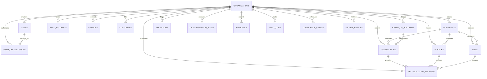

# AI Finance Copilot — Database Schema & Entity Relationship Model

> **Database Engine**: PostgreSQL 16 (Primary Production) / Embedded PGlite 0.2 (Local Development/Test)  
> **Schema Definition Files**: `src/migrations/001_initial_schema.sql`, `src/lib/schema.sql`

---

## 1. Entity-Relationship Diagram



---

## 2. Table Specifications & Constraint Inventory

### 1. `organizations`
* **Primary Key**: `id VARCHAR(50)`
* **Columns**: `name VARCHAR(255) NOT NULL`, `legal_name VARCHAR(255)`, `tax_id VARCHAR(50)`, `currency VARCHAR(10) DEFAULT 'INR'`, `fiscal_year_start VARCHAR(10) DEFAULT '04-01'`, `materiality_threshold NUMERIC(15, 2) DEFAULT 50000.00`, `suggest_only_mode BOOLEAN DEFAULT TRUE`, `created_at TIMESTAMP WITH TIME ZONE`.

### 2. `users`
* **Primary Key**: `id VARCHAR(50)`
* **Foreign Keys**: `org_id VARCHAR(50) REFERENCES organizations(id) ON DELETE CASCADE`
* **Unique Constraints**: `UNIQUE(email)`
* **Columns**: `name`, `email`, `role`, `password_hash`, `is_active`, `created_at`.

### 3. `user_organizations`
* **Primary Key**: Composite `(user_id, org_id)`
* **Foreign Keys**: `user_id REFERENCES users(id) ON DELETE CASCADE`, `org_id REFERENCES organizations(id) ON DELETE CASCADE`
* **Columns**: `role VARCHAR(50) DEFAULT 'ca'`, `created_at TIMESTAMP`.

### 4. `chart_of_accounts`
* **Primary Key**: `id VARCHAR(50)`
* **Foreign Keys**: `org_id REFERENCES organizations(id) ON DELETE CASCADE`
* **Unique Constraints**: Composite `UNIQUE(org_id, code)`
* **Check Constraints**: `type IN ('asset', 'liability', 'equity', 'revenue', 'expense')`

### 5. `bank_accounts`
* **Primary Key**: `id VARCHAR(50)`
* **Foreign Keys**: `org_id REFERENCES organizations(id) ON DELETE CASCADE`
* **Columns**: `account_name`, `account_number_mask`, `bank_name`, `opening_balance`, `current_balance`.

### 6. `documents`
* **Primary Key**: `id VARCHAR(50)`
* **Foreign Keys**: `org_id REFERENCES organizations(id) ON DELETE CASCADE`, `uploaded_by REFERENCES users(id) ON DELETE SET NULL`
* **New Migration 002 Constraint**: `ADD COLUMN file_hash VARCHAR(64);` + `INDEX idx_documents_org_file_hash ON documents(org_id, file_hash);`

### 7. `transactions`
* **Primary Key**: `id VARCHAR(50)`
* **Foreign Keys**: 
  * `org_id REFERENCES organizations(id) ON DELETE CASCADE`
  * `bank_account_id REFERENCES bank_accounts(id) ON DELETE SET NULL`
  * `document_id REFERENCES documents(id) ON DELETE SET NULL`
  * `category_id REFERENCES chart_of_accounts(id) ON DELETE SET NULL`
  * `approved_by REFERENCES users(id) ON DELETE SET NULL`
* **Check Constraints**: `amount >= 0`, `type IN ('credit', 'debit')`
* **Indexes**: `idx_transactions_org_date ON transactions(org_id, date DESC)`, `idx_transactions_org_rec ON transactions(org_id, reconciliation_status)`

### 8. `invoices` (Sales Invoices)
* **Primary Key**: `id VARCHAR(50)`
* **Foreign Keys**: `org_id REFERENCES organizations(id) ON DELETE CASCADE`, `document_id REFERENCES documents(id) ON DELETE SET NULL`
* **New Migration 002 Constraint**: Composite `UNIQUE(org_id, invoice_number)`
* **Check Constraints**: `total_amount >= 0`, `tax_amount >= 0`

### 9. `bills` (Vendor Payables)
* **Primary Key**: `id VARCHAR(50)`
* **Foreign Keys**: `org_id REFERENCES organizations(id) ON DELETE CASCADE`, `document_id REFERENCES documents(id) ON DELETE SET NULL`
* **New Migration 002 Constraint**: Composite `UNIQUE(org_id, bill_number)`
* **Check Constraints**: `total_amount >= 0`, `tax_amount >= 0`

### 10. `reconciliation_records`
* **Primary Key**: `id VARCHAR(50)`
* **Foreign Keys**:
  * `org_id REFERENCES organizations(id) ON DELETE CASCADE`
  * `transaction_id REFERENCES transactions(id) ON DELETE CASCADE`
  * `reviewed_by REFERENCES users(id) ON DELETE SET NULL`
* **Isolation Invariant**: The reconciliation engine strictly matches `transactions WHERE org_id = $1` with `invoices/bills WHERE org_id = $1`. Cross-tenant candidate generation is mathematically impossible because the matching SQL explicitly scopes both candidate sets to the single active `orgId`.

---

## 3. Migration Roadmap (Migration 002)

File: `src/migrations/002_security_constraints_and_idempotency.sql`

```sql
-- 1. Invoices & Bills Unique Numbers per Organization
ALTER TABLE invoices ADD CONSTRAINT uq_org_invoice_number UNIQUE (org_id, invoice_number);
ALTER TABLE bills ADD CONSTRAINT uq_org_bill_number UNIQUE (org_id, bill_number);

-- 2. Document File Hash for Idempotency
ALTER TABLE documents ADD COLUMN IF NOT EXISTS file_hash VARCHAR(64);
CREATE INDEX IF NOT EXISTS idx_documents_org_file_hash ON documents(org_id, file_hash);

-- 3. Integrity Check Constraints
ALTER TABLE transactions ADD CONSTRAINT chk_transactions_amount CHECK (amount >= 0);
ALTER TABLE transactions ADD CONSTRAINT chk_transactions_type CHECK (type IN ('credit', 'debit'));
ALTER TABLE invoices ADD CONSTRAINT chk_invoices_amount CHECK (total_amount >= 0);
ALTER TABLE bills ADD CONSTRAINT chk_bills_amount CHECK (total_amount >= 0);

-- 4. High-Performance Ledger Query Indexes
CREATE INDEX IF NOT EXISTS idx_transactions_org_date ON transactions(org_id, date DESC);
CREATE INDEX IF NOT EXISTS idx_transactions_org_rec ON transactions(org_id, reconciliation_status);
CREATE INDEX IF NOT EXISTS idx_reconciliation_records_org_status ON reconciliation_records(org_id, status);
CREATE INDEX IF NOT EXISTS idx_audit_logs_org_timestamp ON audit_logs(org_id, timestamp DESC);
```
