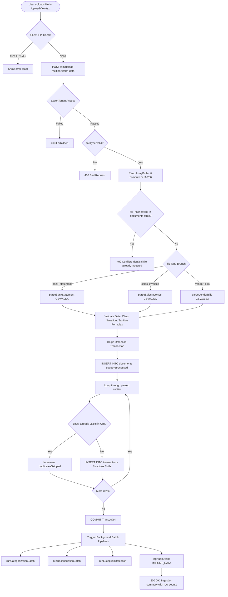
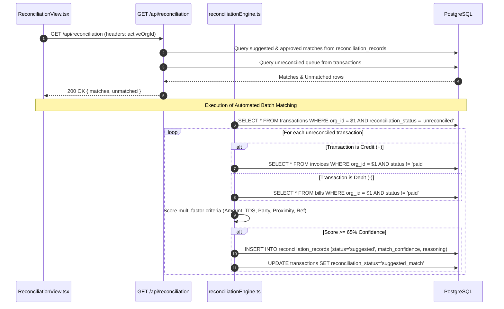
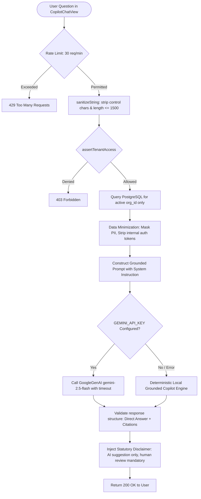
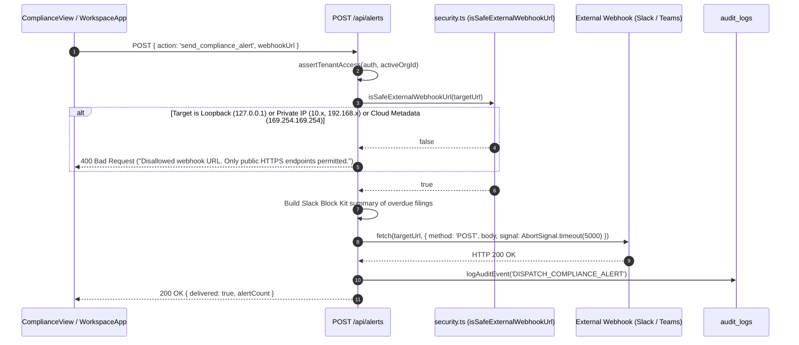

# AI Finance Copilot — Data Flow & Pipeline Architecture

> **Source Verification**: Verified against the implementation files in `src/app/api/`, `src/lib/`, and `src/components/`.

---

## 1. Authentication & Session Lifecycle

The authentication lifecycle strictly isolates authentication (identity verification) from authorization (permission and tenancy checks).

```mermaid
sequenceDiagram
    autonumber
    actor User as User / Browser
    participant Page as /login (LoginForm)
    participant LoginAPI as POST /api/auth/login
    participant RateLimiter as rateLimiter.ts
    participant DB as PostgreSQL (users table)
    participant AuthLib as auth.ts (PBKDF2 & HMAC)
    participant Edge as middleware.ts
    participant AppAPI as Protected API (/api/transactions)

    User->>Page: Enters email, password & selects Role
    Page->>LoginAPI: POST { email, password, role }
    LoginAPI->>RateLimiter: checkRateLimit('auth_login', clientIp)
    alt Rate Limit Exceeded
        RateLimiter-->>LoginAPI: { allowed: false, resetSeconds }
        LoginAPI-->>User: 429 Too Many Requests (Retry-After header)
    end
    RateLimiter-->>LoginAPI: { allowed: true }

    LoginAPI->>DB: SELECT id, org_id, password_hash, role, is_active FROM users WHERE email = $1
    alt User not found or inactive
        DB-->>LoginAPI: Empty / Inactive
        LoginAPI-->>User: 401 Unauthorized (Generic "Invalid email or password")
    end

    LoginAPI->>AuthLib: verifyPassword(password, storedHash)
    alt Password Invalid
        AuthLib-->>LoginAPI: false
        LoginAPI-->>User: 401 Unauthorized
    end
    AuthLib-->>LoginAPI: true

    LoginAPI->>AuthLib: createSessionToken({ userId, userName, userEmail, role, orgId })
    AuthLib-->>LoginAPI: token = base64url(payload) + '.' + HMAC_SHA256(payload, secret)

    LoginAPI-->>User: 200 OK + Set-Cookie: copilot_session=token; HttpOnly; SameSite=Lax; Path=/; Max-Age=86400

    Note over User,AppAPI: Subsequent Protected API Request
    User->>Edge: GET /api/transactions (Cookie: copilot_session=...)
    Edge->>Edge: verifySessionEdge(token)
    alt Invalid Signature or Expired
        Edge-->>User: 401 Unauthorized ("Authentication required")
    end
    Edge->>AppAPI: Forward verified request

    AppAPI->>AuthLib: getAuthContext(req)
    AuthLib->>DB: SELECT 1 FROM user_organizations WHERE user_id = $1 AND org_id = $2
    alt User Not Member of Org
        AuthLib-->>AppAPI: throw 403 Forbidden ("Tenant Isolation Violation")
        AppAPI-->>User: 403 Forbidden
    end
    AppAPI->>DB: SELECT * FROM transactions WHERE org_id = $1
    DB-->>AppAPI: Tenant-Isolated Data
    AppAPI-->>User: 200 OK
```

---

## 2. Ingestion & File Processing Pipeline

The upload pipeline ingests bank statements, sales invoices, and vendor bills.



---

## 3. Financial Reconciliation Flow



---

## 4. AI Copilot Data Flow & Security Boundary



---

## 5. Webhook Alerting & SSRF Protection Flow


