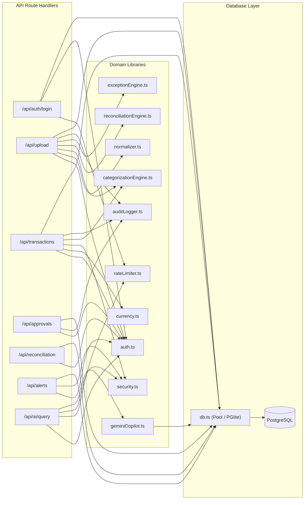

# AI Finance Copilot — Component Dependency & Data Map

> **Forensic Codebase Analysis**: Based strictly on actual codebase inspection of `/Users/niharmehta/Desktop/AI fin ance copilot`.

---

## 1. Component Registry & Verification Matrix

| Component | Exact File Path | Main Exported Symbols | Incoming Dependencies | Outgoing Dependencies | Tables Used | Routes Using It | Env Vars | Status |
| :--- | :--- | :--- | :--- | :--- | :--- | :--- | :--- | :--- |
| **Edge Crypto** | [`src/lib/auth-edge.ts`](file:///Users/niharmehta/Desktop/AI%20fin%20ance%20copilot/src/lib/auth-edge.ts) | `verifySessionEdge`, `createSessionEdge` | `middleware.ts`, tests | None (Web Crypto API) | None | All `/api/*` & workspaces | `SESSION_SECRET` | **IMPLEMENTED** |
| **Session & Auth Guard** | [`src/lib/auth.ts`](file:///Users/niharmehta/Desktop/AI%20fin%20ance%20copilot/src/lib/auth.ts) | `createSessionToken`, `verifySessionToken`, `hashPassword`, `verifyPassword`, `getAuthContext`, `assertTenantAccess`, `checkRoleAccess`, `getAccessibleOrganizations` | API routes, test suites | `db.ts`, `permissions.ts`, Node `crypto` | `users`, `organizations`, `user_organizations` | 21 API routes | `SESSION_SECRET`, `NODE_ENV` | **PARTIALLY IMPLEMENTED** (Backdoor password bypasses present in verifyPassword) |
| **RBAC Matrix** | [`src/lib/permissions.ts`](file:///Users/niharmehta/Desktop/AI%20fin%20ance%20copilot/src/lib/permissions.ts) | `ROLE_PERMISSIONS`, `hasPermission`, `canAccessWorkspace`, `normalizeRole`, `getWorkspaceDashboardPath` | `auth.ts`, `middleware.ts`, `WorkspaceApp.tsx`, `Sidebar.tsx` | None | None | Workspace routing, API authz | None | **IMPLEMENTED** |
| **Database Pool & Client** | [`src/lib/db.ts`](file:///Users/niharmehta/Desktop/AI%20fin%20ance%20copilot/src/lib/db.ts) | `getDb`, `closeDb`, `QueryResult`, `DbClient`, `DbHealth` | All domain services & API routes | `pg` (Pool), `@electric-sql/pglite`, `migrations.ts` | All 18 tables | All `/api/*` | `DATABASE_URL`, `DATABASE_CA_CERT`, `DATABASE_CA_CERT_FILE` | **IMPLEMENTED** |
| **Migrations Runner** | [`src/lib/migrations.ts`](file:///Users/niharmehta/Desktop/AI%20fin%20ance%20copilot/src/lib/migrations.ts) | `runMigrations` | `db.ts`, `scripts/migrate.ts` | Node `fs`, Node `path`, `db.ts` | `_migrations` | Executed on DB startup | None | **IMPLEMENTED** |
| **Backup Engine** | [`src/lib/backup.ts`](file:///Users/niharmehta/Desktop/AI%20fin%20ance%20copilot/src/lib/backup.ts) | `createBackup`, `restoreBackup` | `scripts/backup.ts`, `scripts/restore.ts` | `db.ts`, Node `fs`, Node `path` | All 18 tables | CLI tools | None | **IMPLEMENTED** |
| **Financial Currency Math** | [`src/lib/currency.ts`](file:///Users/niharmehta/Desktop/AI%20fin%20ance%20copilot/src/lib/currency.ts) | `roundCurrency`, `toPaisa`, `fromPaisa`, `validateFinancialAmount`, `calculateGst`, `calculateTds`, `formatINR` | `upload/route.ts`, `transactions/route.ts`, `dashboard/route.ts`, tests | None | None | `/api/transactions`, `/api/dashboard`, `/api/upload` | None | **IMPLEMENTED** |
| **Spreadsheet Normalizer** | [`src/lib/normalizer.ts`](file:///Users/niharmehta/Desktop/AI%20fin%20ance%20copilot/src/lib/normalizer.ts) | `parseBankStatement`, `parseSalesInvoices`, `parseVendorBills`, `normalizeDate`, `normalizeAmount`, `extractCounterparty` | `src/app/api/upload/route.ts`, tests | `papaparse`, `xlsx` | None | `/api/upload` | None | **PARTIALLY IMPLEMENTED** (Lacks formula injection sanitization and fails to reject invalid dates) |
| **Categorization Engine** | [`src/lib/categorizationEngine.ts`](file:///Users/niharmehta/Desktop/AI%20fin%20ance%20copilot/src/lib/categorizationEngine.ts) | `runCategorizationBatch`, `categorizeTransaction` | `upload/route.ts`, `transactions/process/route.ts`, `transactions/route.ts` | `db.ts`, `auditLogger.ts` | `transactions`, `categorization_rules`, `chart_of_accounts` | `/api/upload`, `/api/transactions`, `/api/transactions/process` | None | **IMPLEMENTED** |
| **Reconciliation Engine** | [`src/lib/reconciliationEngine.ts`](file:///Users/niharmehta/Desktop/AI%20fin%20ance%20copilot/src/lib/reconciliationEngine.ts) | `matchTransaction`, `runReconciliationBatch`, `calculateDateDiffDays`, `cleanText` | `upload/route.ts`, `transactions/process/route.ts`, `reconciliation/route.ts` | `db.ts` | `transactions`, `invoices`, `bills`, `reconciliation_records` | `/api/upload`, `/api/transactions/process`, `/api/reconciliation` | None | **PARTIALLY IMPLEMENTED** (Only batch match exists; individual POST match/unmatch route is missing) |
| **Exception Engine** | [`src/lib/exceptionEngine.ts`](file:///Users/niharmehta/Desktop/AI%20fin%20ance%20copilot/src/lib/exceptionEngine.ts) | `runExceptionDetection` | `upload/route.ts`, `transactions/process/route.ts` | `db.ts` | `transactions`, `invoices`, `bills`, `exceptions` | `/api/upload`, `/api/transactions/process`, `/api/exceptions` | None | **IMPLEMENTED** |
| **GSTR-2B Reconciliation** | [`src/lib/gstr2bEngine.ts`](file:///Users/niharmehta/Desktop/AI%20fin%20ance%20copilot/src/lib/gstr2bEngine.ts) | `reconcileITC`, `seedGSTR2BIfEmpty` | `src/app/api/gstr2b/route.ts`, tests | `db.ts` | `gstr2b_entries`, `bills` | `/api/gstr2b` | None | **IMPLEMENTED** |
| **AI Copilot** | [`src/lib/geminiCopilot.ts`](file:///Users/niharmehta/Desktop/AI%20fin%20ance%20copilot/src/lib/geminiCopilot.ts) | `askFinancialCopilot` | `src/app/api/ai/query/route.ts`, tests | `@google/genai`, `db.ts`, `logger.ts` | `transactions`, `invoices`, `bills`, `exceptions`, `chart_of_accounts` | `/api/ai/query` | `GEMINI_API_KEY` | **IMPLEMENTED** |
| **Audit Logger** | [`src/lib/auditLogger.ts`](file:///Users/niharmehta/Desktop/AI%20fin%20ance%20copilot/src/lib/auditLogger.ts) | `logAuditEvent`, `recordApproval` | 10 API route handlers | `db.ts` | `audit_logs`, `approvals` | Approvals, Transactions, Uploads, Rules, Exceptions | None | **IMPLEMENTED** |
| **Application Security** | [`src/lib/security.ts`](file:///Users/niharmehta/Desktop/AI%20fin%20ance%20copilot/src/lib/security.ts) | `safeParseJson`, `sanitizeString`, `isValidDate`, `isValidPAN`, `isValidGSTIN`, `isSafeExternalWebhookUrl` | API routes, `alerts/route.ts` | Node `net`, Node `url` | None | `/api/alerts`, `/api/transactions`, `/api/ai/query` | None | **IMPLEMENTED** |
| **Rate Limiter** | [`src/lib/rateLimiter.ts`](file:///Users/niharmehta/Desktop/AI%20fin%20ance%20copilot/src/lib/rateLimiter.ts) | `checkRateLimit`, `getClientIp` | Auth login, Pilot request, AI query routes | None (in-memory) | None | `/api/auth/login`, `/api/pilot-request`, `/api/ai/query` | None | **IMPLEMENTED** |
| **Edge Middleware** | [`src/middleware.ts`](file:///Users/niharmehta/Desktop/AI%20fin%20ance%20copilot/src/middleware.ts) | `middleware`, `config` | Next.js Engine | `auth-edge.ts`, `permissions.ts` | None | All incoming HTTP requests | `SESSION_SECRET` | **IMPLEMENTED** |
| **Workspace Orchestrator** | [`src/components/WorkspaceApp.tsx`](file:///Users/niharmehta/Desktop/AI%20fin%20ance%20copilot/src/components/WorkspaceApp.tsx) | `WorkspaceApp` | Role dashboard pages (`ca`, `business`, `admin`) | 12 View components, Topbar, Sidebar | None | Frontend SPA wrapper | None | **IMPLEMENTED** |

---

## 2. Cross-Component Invocation Graph

