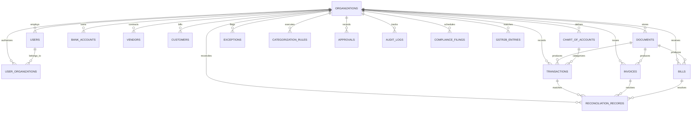

# AI Finance Compliance Copilot — Architecture & Technical Reference

> **Status**: Verified against current production codebase implementation (September 2026).

---

## 1. System Overview

AI Finance Compliance Copilot is a multi-tenant financial operations platform tailored for Indian accounting standards, GST (GSTR-2B Input Tax Credit reconciliation), and statutory TDS compliance under the Income-tax Act.

```
┌────────────────────────────────────────────────────────────────────────┐
│                        Next.js Full-Stack Application                  │
│   - Frontend: React 18 + Vanilla CSS Design Tokens (Dark Mode)         │
│   - API Layer: Next.js App Router API Handlers (Edge & Node.js)        │
└───────────────────────────────────┬────────────────────────────────────┘
                                    │
          ┌─────────────────────────┼─────────────────────────┐
          ▼                         ▼                         ▼
┌───────────────────┐     ┌───────────────────┐     ┌───────────────────┐
│  Statutory TDS    │     │  GSTR-2B Rec      │     │  Bank Rec Engine  │
│  - 1961/2025 Act  │     │  - GSTN Parsers   │     │  - 1:1 / 1:N / N:1│
│  - Section Rates  │     │  - Integer Paise  │     │  - TDS-Net Match  │
│  - 26Q Worksheets │     │  - Sec 16(4)/17(5)│     │  - Batch Indexed  │
└───────────────────┘     └───────────────────┘     └───────────────────┘
          │                         │                         │
          └─────────────────────────┼─────────────────────────┘
                                    ▼
┌────────────────────────────────────────────────────────────────────────┐
│                    PostgreSQL / PGlite Relational Store                │
│   - Tenant Scoping (org_id on all tables)                              │
│   - Multi-Tenant RBAC (CA, BUSINESS_OWNER, FIRM_ADMIN)                 │
│   - Versioned Migrations (001 through 007)                             │
└────────────────────────────────────────────────────────────────────────┘
```

---

## 2. Multi-Tenant Security & RBAC Model

### Roles & Authorization Boundaries
- **Chartered Accountant (`CA`)**: Manages compliance portfolios across client organizations, reviews GSTR-2B mismatches, approves statutory TDS rules, and confirms ledger reconciliations.
- **Business Owner (`BUSINESS_OWNER`)**: Scoped strictly to their own organization (`org_id`). Can upload statements, view read-only dashboards, and raise queries.
- **Firm Admin (`FIRM_ADMIN`)**: Manages firm-wide users, client organizations, and organization provisioning.

### Tenancy Enforcement
- Every API endpoint resolving tenant data executes `getAuthContext(req)` and `assertTenantAccess(auth, targetOrgId)`.
- Membership is checked against `user_organizations` table.
- Development auth fallback (`x-user-role`, `x-org-id`) is **strictly default-denied** and requires `ALLOW_INSECURE_DEV_AUTH=true` explicitly in non-production environments.

---

## 3. Statutory TDS Compliance Engine

### Versioned Regimes & Rates
Supports dual versioned statutory regimes in `src/lib/statutoryRules.ts`:
1. **Income-tax Act, 1961** (for dates prior to 2026-04-01):
   - **Section 194C**: Contractors / sub-contractors (2% corporate/firm, 1% individual).
   - **Section 194J(a)**: Fees for Technical Services (FTS) & IT call centers (2% per Finance Act 2020).
   - **Section 194J(b)**: Fees for Professional Services & Royalty (10%).
   - **Section 194H**: Commission / Brokerage (2% post-Oct 2024 per Finance Act 2024).
   - **Section 194I**: Rent for Land, Building, or Furniture (10%); Plant/Machinery (2%).
   - **Section 194Q**: Purchase of Goods (0.1%).
2. **Income-tax Act, 2025 Framework** (for dates on or after 2026-04-01):
   - Tabular Section 393 framework with mandatory CA sign-off before calculation activation.

### Integrity & Attestation
- CA approval of statutory rules generates a SHA-256 rule version hash stored in `rule_version_hash`.
- Any edit to rate, thresholds, or payment codes invalidates approval status and forces `NEEDS_CA_REVIEW`.
- Dynamic threshold lookups are loaded from the database; draft unverified rules with null thresholds return `tdsAmount = null` rather than bypassing withholding.

---

## 4. GSTR-2B Reconciliation Engine

- **Schema Provenance**: JSON keys (`ctin`, `trdnm`, `inv`, `inum`, `idt`, `val`, `itcavl`, `rsn`, `items`, `txval`, `iamt`, `camt`, `samt`) and Excel columns derived from live GST Developer Portal Returns API and GST Portal Advisory No. 402.
- **Integer-Paise Precision**: All monetary calculations operate in integer paise to eliminate floating-point rounding errors.
- **Rounding Tolerances**: Default ₹1.00 (100 paise), maximum ₹2.00 (200 paise) tolerance for invoice vs portal variance. Percentage-based bands are prohibited.
- **Statutory ITC Rules**:
  - Auto-flags Section 17(5) blocked credits as ineligible.
  - Flags Section 16(4) time-barred invoices (due date after November 30 of subsequent FY).
  - Handles overseas SaaS vendors without Indian establishments (`tax_id = null`) via Reverse Charge Mechanism (RCM under Section 5(3) of IGST Act), assigning `not_expected_in_2b` and `NEEDS_CA_REVIEW`.

---

## 5. Bank-to-Ledger Reconciliation Engine

- **Batch Indexed Matching**: `runReconciliationBatch(orgId)` loads open invoices and bills once per batch into memory, indexing by counterparty, reference number, and amount.
- **Multi-Type Match Suggestions**:
  - **1:1 Exact Match**: Exact amount match within date window.
  - **TDS-Net Settlement**: Vendor payment matching gross bill minus statutory TDS (e.g. 194J(a) 2%, 194J(b) 10%, 194C 2%, 194Q 0.1%) resolved from `STATUTORY_TDS_RULES`.
  - **1:N Batched Payment**: One debit transaction matching the aggregate sum of multiple open bills from the same vendor (`status: 'suggested'`).
  - **N:1 Partial Payment**: Payment strictly less than open invoice/bill balance (`status: 'suggested'`).
- **Scoring Weights & Boundaries**: Named constants in `RECONCILIATION_WEIGHTS` and `RECONCILIATION_THRESHOLDS`.

---

## 6. Security Architecture & Threat Model

- **Session Security**: Cryptographically signed HMAC-SHA256 session tokens stored in secure, `httpOnly`, `sameSite: lax` cookies (`copilot_session`).
- **Password Storage**: PBKDF2 with SHA-512 and random cryptographic salts (`crypto.randomBytes(16)`). Development seeds read configurable passwords via `DEMO_USER_PASSWORD` or role-specific `SEED_CA_PASSWORD`, `SEED_OWNER_PASSWORD`, `SEED_ADMIN_PASSWORD`, `SEED_DEMO_CA_PASSWORD`, etc.
- **LLM Safety & Data Boundary**:
  - Bank narrations passed to Gemini are length-capped to 500 characters (`maxChars = 500`) and stripped of ASCII control characters (`[\x00-\x1F\x7F]`).
  - Narrations are wrapped inside `<untrusted_bank_narration>` XML boundary tags.
  - AI JSON responses are strictly validated against active Chart of Accounts schemas before acceptance.
- **SSRF & Webhook Defense**: `isSafeExternalWebhookUrl` enforces HTTPS and blocks private RFC 1918 subnets, loopback, and cloud metadata endpoints (`169.254.169.254`).

---

## 7. Database Entity Relationship Model



---

## 8. Ingestion & Reconciliation Data Flow

1. **Document Ingestion Pipeline**:
   - Standard upload via `/api/upload` accepting CSV / XLSX.
   - Text fields sanitized against formula injection (`=`, `+`, `-`, `@`, `\t`, `%`).
   - Normalizer extracts dates, amounts (integer paise), transaction types, references (UTR, UPI, IMPS, NEFT), and counterparties.
2. **Reconciliation Pipeline**:
   - `runReconciliationBatch(orgId)` queries open invoices, bills (with TDS section), and unreconciled bank transactions.
   - Deterministic matching scores candidate pairs; high-confidence exact matches are auto-confirmed.
   - TDS-net payments evaluate statutory rate on pre-GST base and suggest settlement.
   - Partial payments and batched multi-bill payments are proposed as suggestions (`status: 'suggested'`).
3. **GSTR-2B Audit Pipeline**:
   - Parses official GSTN portal JSON or offline Excel exports.
   - Executes 8-way deterministic classification against books purchase register.
   - Flags Section 17(5) blocked credits, Section 16(4) time-barred invoices, and RCM foreign vendors.

---

## 9. Module Architecture & Dependencies

- **Database Layer**: `src/lib/db.ts` (PostgreSQL / PGlite) + `src/lib/migrations.ts`.
- **Security & RBAC**: `src/lib/auth.ts`, `src/lib/permissions.ts`, `src/lib/security.ts`.
- **Compliance & Rules**: `src/lib/statutoryRules.ts`, `src/lib/gstr2bEngine.ts`, `src/lib/reconciliationEngine.ts`.
- **File Parsing**: `src/lib/normalizer.ts`, `src/lib/excelHelper.ts` (isolated bare bundle loader).
- **AI Copilot**: `src/lib/geminiCopilot.ts` with structured schema validation and untrusted data boundaries.

---

## 10. Testing Structure

- Unit and regression suites located in `tests/`:
  - `tests/reconciliation.test.ts`: Bank-to-ledger matching, TDS net settlement (with pre-GST base and 194J sub-sections), and precision/recall benchmarks.
  - `tests/gstr2b.test.ts`: GSTR-2B normalization, paise arithmetic, and 8-way classification.
  - `tests/normalizer.test.ts`: Indian banking narration parsing and formula injection defenses.
  - `tests/tds.test.ts` & `tests/phase1_tds_compliance.test.ts`: TDS rates, threshold checks, and Form 26Q logic.
  - `tests/phase5_security.test.ts`: Authentication, rate limiting, and narration boundary sanitization.
  - `tests/security_financial.test.ts` & `tests/rbac_auth.test.ts`: Tenant isolation and RBAC assertion guards.
